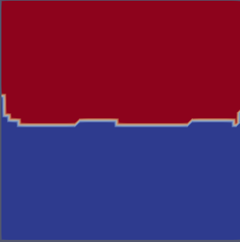

# Plugins for data-driven filters in Paraview
## Table of Contents

* [About the Project](#about-the-project)
    * [Done By](#done-by)
* [Instructions for installation](#instructions-for-installation)
* [Instructions to use filter plugin in Paraview](#instructions-to-use-filter-plugin-in-paraview)
* [Instructions to train the models](#instructions-to-train-the-models)
* [Example Results](#example-results)
* [Directory Structure inside 'thesis-code'](#directory-structure-inside-'thesis-code')
* [Contributing](#contributing)

## About the Project
To couple the interface of **[Paraview](https://www.paraview.org/)**, *a visualization application*, and **[PyTorch](https://pytorch.org/)**, *a machine learning framework*, I have developed plugins in Paraview that allow users to load *pre-trained models* of their choice.  Pre-trained means that machine learning models have been already trained on some form of dataset and carry the resultant weights and biases. These plugins transform the input data by feeding it into the model and then visualize the model’s output. The filters builtin Paraview,  till the time of writing,  are based on deterministic algorithms to modify or extract slices of input data. These plugins extend the filters in Paraview to include algorithms based on data-driven transformations. This repository contains four plugins for the use cases: *image segmentation, image classification, fluid classification & fluid segmentation* respectively.
### Done By -
[**Drishti Maharjan**](https://github.com/drishti-m) - d.maharjan@jacobs-university.de 


## Instructions for installation
The plugins have been developed with *Paraview `5.8.1`* built against *Python `3.8.5`*. 
Follow instructions to build Paraview [here](https://gitlab.kitware.com/paraview/paraview/blob/master/Documentation/dev/build.md). Make sure to turn on `PARAVIEW_USE_PYTHON` option while building it to enable
Python support.

For installation of other packages and libraries:3.7.4
```
cd thesis-code
conda create --name <env> python=3.7.4 --file requirements.txt
conda activate <env>
pip install -r pip-requirements.txt
```
Some packages are not available in conda so those packages are listed in pip-requirements and are to be 
installed via pip.

## Instructions to use filter plugin in Paraview
1. In the conda environment you built, open Paraview
2. Go to `Tools -> Manage Plugins -> Load New`.
3. Find the location of the code of plugins in your disk (here, inside `plugin-src/` directory)
4. Load all plugins required, eg, `plugin-src/fluid_classifier_plugin.py`
5. Open you source input file in Paraview by `File -> Open`.
6. After loading your input source, Go to `Filters -> Search`.
7. Type the name of the filer (named below)

The main plugins in this repository are named as follows:
* ML_Fluid_Classifier
* ML_Fluid_Segmentation
* ML_Img_Classifier
* ML_Img_Segmentation

The test plugins in this repository are named as follows:
* Threshold_Fluid_Classify
* Threshold_Fluid_Segment
The test plugins are to see the ground truth results of computed fluid classification and segmentation, and are used to compare with the ML based classification & segmentation.

## Instructions to train the models
The pre-trained models are already provided in the directory `pre-trained-models`. The models for image classification and segmentation were downloaded from PyTorch, rest were trained by author. But, if you wish to
train the model for fluid classification and segmentation, follow the instructions below.

* Go to directory `model-training/`.
* Run `python train_fluid_classifier.py` for fluid classifier, and
`python train_fluid_segment.py` for fluid segmentation, and the models
will be saved at `model-training/models`.
* To check the graph of training & validation loss, run
`tensorboard --logdir model-training/runs/` from the outer directory.


## Example Results

The *"Surface view"* results of applying Fluid Segmentation Plugin for velocity data of a given timestep in Paraview are below.

**Original Velocity Magnitude View in Paraview**:


**Above data Segmented by Plugin in Paraview**:



## Directory Structure inside 'thesis-code'
```
├── model-training                         # training of models
│   ├── datasets                           # training data 
│   │   ├── pressure                       # pressure data 
│   │   └── velocity                       # velocity data
│   ├── models                             # directory to save models
├── plugin-src                             # main directory with source code of plugins
│   ├── fluid_classifier_plugin.py         # plugin for fluid classification
│   ├── fluid_segment_plugin.py            # plugin code for fluid segmentation
│   ├── img_classifier_plugin.py           # plugin code for image classification
│   ├── img_segment_plugin.py              # plugin code for image segmentation
├── plugin-test                            # source code for test plugins (ground truth)
├── pre-trained-models                     # all pre-trained models 
│   ├── fluid-classify                     # pre-trained models for fluid classification
│   ├── fluid-segment                      # pre-trained models for fluid segmentation
│   ├── img-classify                       # pre-trained models for img classification
│   └── img-segment                        # pre-trained models for img segmentation
├── README.md                              # readme
└── requirements.txt                       # package requirements
└── Rough ideas                            # Initial idea/experiment with Programmable Filter

```

## Contributing

Contributions are what make the open source community such an amazing place to learn, inspire, and create. Any contributions you make are **greatly appreciated**.

1. Fork the Project
2. Create your Feature Branch (`git checkout -b feature/Feature_Name`)
3. Commit your Changes (`git commit -m 'Add some Feature_Name`)
4. Push to the Branch (`git push origin feature/Feature_Name`)
5. Open a Pull Request

## Potential Future Work

- [ ] Replacing the neural network models with 
advanced turbulence classifier